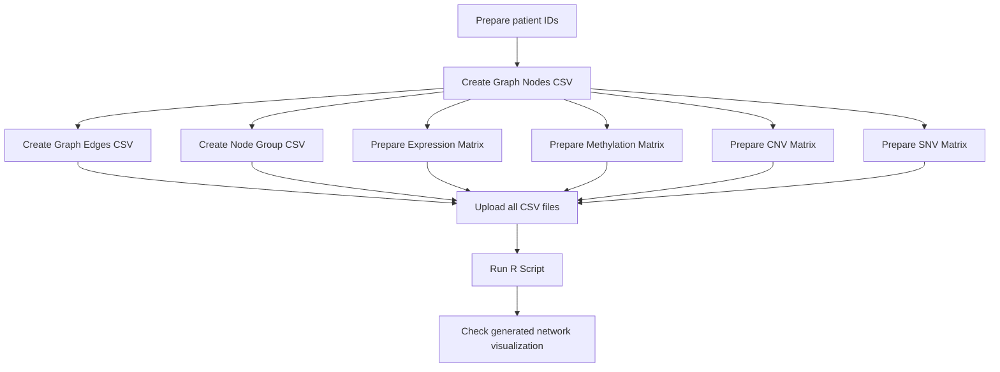

# Patient–Patient Network Tutorial

This tutorial explains how to prepare and upload the CSV files for a **Patient–Patient interaction network**.

A Patient–Patient network is used to visualize similarity relationships between patient samples, such as TCGA samples. In this network:

- each **node** represents one patient sample;
- each **edge** represents a similarity relationship between two patients;
- multi-omics files can be displayed as circular annotation rings around the network.

---

## 1. Quick Start

Prepare the following CSV files and upload them on the **Upload CSV files** page.

| Upload field | Example file name | Required | Purpose |
|---|---:|:---:|---|
| Graph Edges | `patients_example_edges.csv` | Yes | Defines patient-to-patient similarity edges |
| Graph Nodes | `patients_example_nodes.csv` | Yes | Defines all patient nodes in the network |
| Node Group | `patients_example_megList.csv` | Yes | Assigns each patient to a community/group |
| Data 1 | `patients_example_expression_data1.csv` | Yes | Gene expression values, shown as the outer ring |
| Data 2 | `patients_example_methylation_data2.csv` | Yes | DNA methylation values, shown as the second ring |
| Data 3 | `patients_example_cnv_data3.csv` | Yes | CNV states, shown as the third ring |
| Data 4 | `patients_example_snv_data4.csv` | Yes | SNV/mutation states, shown as the inner ring |
| Sample Group | optional sample-group CSV | Optional | Adds group labels for ring bars or stratified visualization |

> Note: some older documents may call the edge file `patients_example_edges_patients.csv`. In the current example package, `patients_example_edges.csv` is usually the expected file name.

---

## 2. Recommended Upload Workflow



Suggested order:

1. Prepare the patient list first.
2. Make sure every patient in the edge file also appears in the node file.
3. Prepare the node group file.
4. Prepare expression, methylation, CNV, and SNV matrices.
5. Upload all required files.
6. Click **Upload Files**.
7. Click **Run R Script**.

---

## 3. Input File Details

### 3.1 Graph Edges File

**Example file:** `patients_example_edges.csv`

This file defines similarity relationships between patients. Each row represents one directed edge from one patient to another patient.

| Column | Required | Description |
|---|:---:|---|
| `from` | Yes | Source patient TCGA sample ID |
| `to` | Yes | Target patient TCGA sample ID |
| `weight` | Yes | Similarity score between the two patients |

Higher `weight` values indicate stronger similarity between patients.

Example:

```csv
from,to,weight
TCGA-E2-A1IN-01A,TCGA-AQ-A0Y5-01A,0.001202
TCGA-BH-A0H9-01A,TCGA-AQ-A0Y5-01A,0.001773
TCGA-A2-A0YT-01A,TCGA-AQ-A0Y5-01A,0.002035
TCGA-D8-A1JA-01A,TCGA-AQ-A0Y5-01A,0.002168
```

Checklist:

- `from` and `to` must use exactly the same patient ID format as the node file.
- Do not leave `weight` empty.
- Use numeric values for `weight`.

---

### 3.2 Graph Nodes File

**Example file:** `patients_example_nodes.csv`

This file defines all patient samples that should appear as nodes in the network.

| Column | Required | Description |
|---|:---:|---|
| `name` | Yes | Patient TCGA sample ID |

Example:

```csv
name
TCGA-3C-AAAU-01A
TCGA-3C-AALI-01A
TCGA-3C-AALJ-01A
TCGA-3C-AALK-01A
TCGA-4H-AAAK-01A
```

Checklist:

- Every patient ID in `from` and `to` of the edge file should also appear in this file.
- Patient IDs must be consistent across all uploaded files.
- Avoid extra spaces before or after patient IDs.

---

### 3.3 Node Group File

**Example file:** `patients_example_megList.csv`

This file assigns each patient to a community or group.

| Column | Required | Description |
|---|:---:|---|
| `name` | Yes | Patient TCGA sample ID |
| `community` | Yes | Integer group/community ID |

Example:

```csv
name,community
TCGA-3C-AAAU-01A,1
TCGA-3C-AALI-01A,1
TCGA-3C-AALJ-01A,1
TCGA-3C-AALK-01A,1
TCGA-4H-AAAK-01A,1
```

If you do not have predefined patient communities, you can use a placeholder integer. For example, assign all patients to `1`.

---

## 4. Multi-Omics Data Files

The Patient–Patient network uses gene-by-patient matrices for multi-omics annotation. In these files:

- rows are **gene symbols**;
- columns are **patient TCGA sample IDs**;
- values are numeric omics measurements or mutation/CNV states.

### 4.1 Gene Expression Matrix

**Example file:** `patients_example_expression_data1.csv`

This file contains normalized gene expression values.

| Format item | Description |
|---|---|
| Rows | Gene symbols |
| Columns | Patient TCGA sample IDs |
| Values | Log2-transformed normalized expression values |

Example:

```csv
gene,TCGA-AQ-A0Y5-01A,TCGA-C8-A274-01A,TCGA-B6-A1KC-01B
TSPAN6,0.642019,1.435314,0.905893
DPM1,1.590688,1.520711,1.46089
SCYL3,0.731065,1.010347,0.716954
FGR,0.327584,0.295589,0.23573
```

> If your file does not explicitly name the first column `gene`, make sure the first column still contains gene symbols and the remaining columns are patient IDs.

---

### 4.2 DNA Methylation Matrix

**Example file:** `patients_example_methylation_data2.csv`

This file has the same structure as the expression matrix.

| Format item | Description |
|---|---|
| Rows | Gene symbols |
| Columns | Patient TCGA sample IDs |
| Values | Normalized methylation levels |

Example:

```csv
gene,TCGA-AQ-A0Y5-01A,TCGA-C8-A274-01A,TCGA-B6-A1KC-01B
TSPAN6,0.627609,0.44052,0.2535
DPM1,0.048339,0.048328,0.068088
SCYL3,0.186311,0.174254,0.216154
FGR,0.64619,0.734972,0.69399
```

---

### 4.3 Copy Number Variation Matrix

**Example file:** `patients_example_cnv_data3.csv`

This file describes copy number variation states for genes across patients.

| Format item | Description |
|---|---|
| Rows | Gene symbols |
| Columns | Patient TCGA sample IDs |
| Values | CNV state |

CNV value meanings:

| Value | Meaning |
|---:|---|
| `0` | Copy-number neutral |
| `1` | Copy-number gain |
| `-1` | Copy-number loss |

Example:

```csv
gene,TCGA-AQ-A0Y5-01A,TCGA-C8-A274-01A,TCGA-B6-A1KC-01B
UPF1,-1,1,1
KRIT1,0,0,0
CREBBP,1,1,-1
MPO,-1,0,1
```

---

### 4.4 Single Nucleotide Variation Matrix

**Example file:** `patients_example_snv_data4.csv`

This file records mutation information for genes across patients. Its structure is the same as the CNV matrix.

| Format item | Description |
|---|---|
| Rows | Gene symbols |
| Columns | Patient TCGA sample IDs |
| Values | Mutation count or mutation state |

SNV value meanings:

| Value | Meaning |
|---:|---|
| `0` | No mutation |
| `1` | One mutation |
| `2` | Two mutations |
| `>0` | Treated as mutation present in downstream analysis |

Example:

```csv
gene,TCGA-AQ-A0Y5-01A,TCGA-C8-A274-01A,TCGA-B6-A1KC-01B
PIK3CA,0,1,0
TP53,1,0,2
BRCA1,0,0,0
GATA3,1,1,0
```

---

## 5. Data Consistency Rules

Before uploading, check these rules carefully.

### Patient ID consistency

Patient IDs must match across files.

For example, this ID:

```text
TCGA-AQ-A0Y5-01A
```

should be written exactly the same way in:

- edge file;
- node file;
- node group file;
- expression matrix columns;
- methylation matrix columns;
- CNV matrix columns;
- SNV matrix columns.

Avoid problems such as:

```text
TCGA-AQ-A0Y5-01A 
TCGA-AQ-A0Y5
 tcga-aq-a0y5-01a
```

These may be treated as different IDs.

---

### Required columns

| File | Required columns |
|---|---|
| `patients_example_edges.csv` | `from`, `to`, `weight` |
| `patients_example_nodes.csv` | `name` |
| `patients_example_megList.csv` | `name`, `community` |
| Expression matrix | first column = gene symbols; other columns = patient IDs |
| Methylation matrix | first column = gene symbols; other columns = patient IDs |
| CNV matrix | first column = gene symbols; other columns = patient IDs |
| SNV matrix | first column = gene symbols; other columns = patient IDs |

---

## 6. ZIP Package Example

If you want to provide a complete example package, compress the CSV files into one ZIP file.

```bash
zip patient_network_example.zip \
patients_example_cnv_data3.csv \
patients_example_edges.csv \
patients_example_expression_data1.csv \
patients_example_megList.csv \
patients_example_methylation_data2.csv \
patients_example_nodes.csv \
patients_example_snv_data4.csv
```

Check the ZIP content:

```bash
unzip -l patient_network_example.zip
```

Expected content:

```text
patients_example_cnv_data3.csv
patients_example_edges.csv
patients_example_expression_data1.csv
patients_example_megList.csv
patients_example_methylation_data2.csv
patients_example_nodes.csv
patients_example_snv_data4.csv
```

---

## 7. Common Problems and Fixes

| Problem | Possible cause | Fix |
|---|---|---|
| Network cannot be generated | Some edge patients are missing from the node file | Add all `from` and `to` patient IDs to `patients_example_nodes.csv` |
| Upload succeeds but visualization is empty | Patient IDs do not match across files | Check capitalization, spaces, and sample ID suffixes |
| Data rings are missing | Matrix columns do not match patient IDs | Make matrix column names identical to node names |
| CNV or SNV ring looks incorrect | Invalid values in CNV/SNV file | Use `-1`, `0`, `1` for CNV; use `0`, `1`, `2` or non-negative mutation counts for SNV |
| Community colors look wrong | `community` values are missing or not integers | Fill the `community` column with integer values |
| CSV upload error | Wrong separator or hidden formatting from Excel | Save as plain CSV UTF-8 and check the header row |

---

## 8. Minimal Example Structure

A minimal patient network package should look like this:

```text
patient_network_example/
├── patients_example_edges.csv
├── patients_example_nodes.csv
├── patients_example_megList.csv
├── patients_example_expression_data1.csv
├── patients_example_methylation_data2.csv
├── patients_example_cnv_data3.csv
└── patients_example_snv_data4.csv
```

---

## 9. Final Checklist Before Upload

- [ ] Edge file contains `from`, `to`, and `weight`.
- [ ] Node file contains all patients used in the edge file.
- [ ] Node group file contains `name` and `community`.
- [ ] Expression matrix columns are patient IDs.
- [ ] Methylation matrix columns are patient IDs.
- [ ] CNV matrix uses valid CNV values: `-1`, `0`, `1`.
- [ ] SNV matrix uses valid mutation values: `0`, `1`, `2`, or other non-negative counts.
- [ ] Patient IDs are identical across all files.
- [ ] Files are saved as `.csv`.
- [ ] ZIP package includes all required CSV files.
